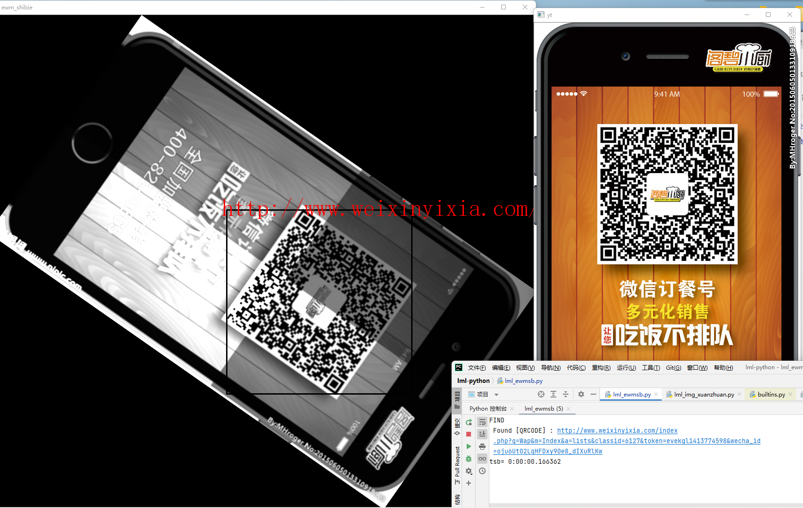

# lml-python

如果不能显示图片  
修改hosts    C:\Windows\System32\drivers\etc    \hosts  
185.199.108.133 raw.githubusercontent.com  
185.199.108.133 githubusercontent.com  
140.82.112.3 github.com  

如果图片显示不全  稍等浏览器加载  是会有点慢

IP地址查询 websites.ipaddress.com  
raw.githubusercontent.com  
github.com  

## 字符识别
# lml_ewmsb.py
二维码识别结果图-zbar-旋转位置干扰模糊光影变换-效果良好

# lml_txmsb.py
条形码识别结果图-zbar-旋转模糊光影-效果良好

## 文字识别OCR
# lml_ocr.py
字符识别ocr结果图-easyocr+tesseract+paddle+baiduocr=>baidu又快又好但是要联网-tesseract快-paddle准确-easyocr最垃圾

## 模板匹配
# lml_mbpp.py
模板匹配结果图-opencv自带算法-初步测试效果正常-旋转后失效

# lml_SIFT.py
模板匹配结果图-SIFT采样特征点-旋转后效果正常

# lml_SURF.py
模板匹配结果图-SURF+特征点过滤-效果良好-速度比SIFT更快

# lml_orb.py
模板匹配结果图-ORB采样+过滤-旋转后效果正常-速度极快

## 瑕疵检测
# lml_xcjc.py
瑕疵检测结果图-点状瑕疵检测

## 轮廓查找
# lml_lkcz.py
轮廓查找结果图-二值化

# lml_byjc.py
边缘检测结果图-canny边缘检测

